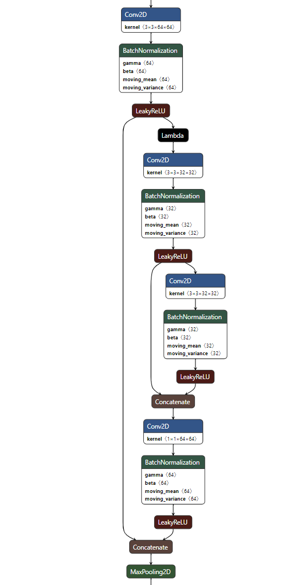
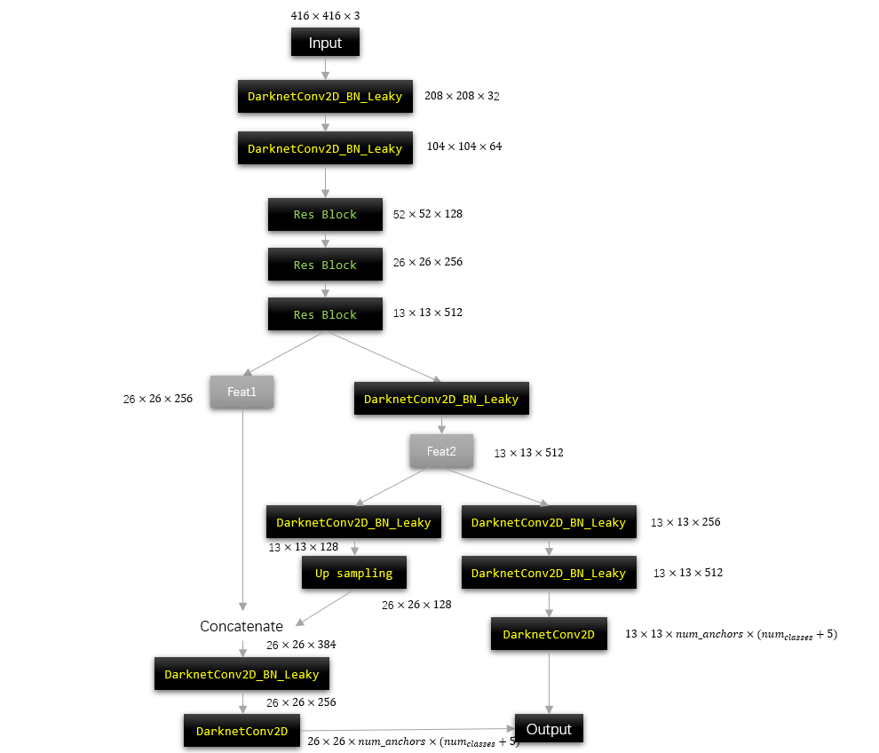
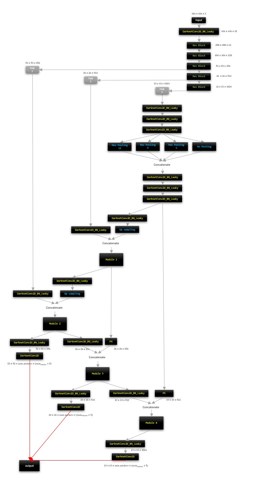

# Tensorflow_YoloV4

---

## Table
- [Tensorflow_YoloV4](#tensorflow_yolov4)
  - [Table](#table)
  - [Dataset](#dataset)
  - [Environment](#environment)
  - [Model](#model)
  - [Loss](#loss)
  - [Performance](#performance)
  - [Run](#run)

## Dataset
BDD100K: A Large-scale Diverse Driving Video Database [Link](https://bair.berkeley.edu/blog/2018/05/30/bdd/)

Download the image and annotation data in the directory `BDD100K`:

```
    BDD100K
    └─Annotations
    │   └─Train
    │       ├─ **.xml
    │   └─Val
    │       ├─ **.xml
    └─images
    │   └─100k
    │       └─Train
    │           ├─ **.jpg
    │       └─Val
    │           ├─ **.jpg
    │       └─Test
    │           ├─ **.jpg
    └─ImageSets
    │   └─Main
    │       ├─ train.txt
    │       ├─ val.txt
    └─labels
    │   └─detection18
    │       ├─ bdd100k_labels_images_train.jason
    │       ├─ bdd100k_labels_images_val.jason
    │   └─detection20
    │           ├─ det_v2_train_release.jason
    │           ├─ det_v2_val_release.jason

``` 


1. In `Preparation`, translate VOC xml annotations to txt annotations

    `python3 voc2txt_annotation.py -name bdd100k_obj -input_dir D:/BDD100K/ -save data_txt` 
    
2. Use K-means to generate the anchors 
    
    - 9 anchors for 3 scale levels (32, 16, 8)
    - 3 anchors for each scale level
    
    `python3 kmeans_for_anchors.py -size (416, 416) -anchors_num 9 -path D:/BDD100K/Annotations_18/train -save_path data_txt/BDD100K_yolov4_anchors_416_416.txt` 

## Environment

## Model
- Tiny CSPdarknet53 - ResBlock_body
<p align="center">
    

- Tiny YoloV4
<p align="center">
      

- YoloV4
<p align="center">
      

## Loss


## Performance

## Run 

1. Split the dataset for train, test, validation

     `python3 preparation/data_split.py` 
     
2. Use K-means to generate the anchors. 
    
    - 9 anchors for 3 scale levels (32, 16, 8)
    - 3 anchors for each scale level
    
    `python3 preparation/kmeans_for_anchors.py` 

3. Translate VOC xml annotations to txt annotations

    `python3 preparation/voc2txt_annotation.py` 
    
4. Training the YoloBody

    `python3 trainer/Train.py` 
    
5. Launch the training 
    
    Train settings will be shown as follows:

    <p align="center">
        